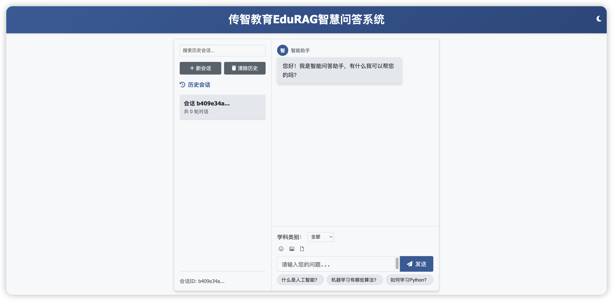

# 黑马程序员智能问答系统产品需求文档 (PRD)

## 1. 项目概述

### 1.1 产品背景
随着IT教育市场竞争加剧，学生对高质量、即时性学习支持的需求日益增长。传统的人工答疑方式效率低下，难以满足学生个性化、多样化的学习需求。为提升教学服务质量、降低教师工作负担，我们计划开发一款智能问答系统，为学生提供7x24小时的专业学习支持。

### 1.2 产品目标
- **提升学习体验**: 为学生提供即时、准确的学习答疑服务
- **提高教学效率**: 减少教师重复性答疑工作，聚焦深度教学
- **增强竞争力**: 通过智能化服务提升机构品牌形象
- **数据驱动改进**: 收集学习数据，优化教学内容

### 1.3 目标用户
- **主要用户**: IT培训学员
- **次要用户**: 授课教师、助教
- **使用场景**: 
  - 课后自主学习答疑
  - 项目实践问题求助
  - 知识点复习巩固

## 2. 产品功能需求

### 2.1 用户交互功能

#### 2.1.1 首页访问
- **用户故事**: 作为学生，我希望访问系统首页，快速开始提问，以便获得学习帮助
- **功能描述**: 用户访问系统时，展示简洁友好的交互界面
- **验收标准**: 
  - 页面加载时间 < 2秒
  - 界面清晰易用
  - 支持移动端访问

#### 2.1.2 会话管理
- **用户故事**: 作为学生，我希望系统能记住我的对话历史，以便延续之前的讨论话题
- **功能描述**: 系统自动管理用户会话，保存对话记录

##### 2.1.2.1 会话创建
- **功能描述**: 用户首次访问时自动创建会话，或用户主动创建新会话
- **验收标准**: 
  - 会话创建无感知
  - 支持多个并行会话

##### 2.1.2.2 历史查看
- **功能描述**: 用户可查看当前会话的对话历史
- **验收标准**: 
  - 历史记录按时间倒序显示
  - 支持滚动加载更多记录

##### 2.1.2.3 历史清除
- **功能描述**: 用户可清除当前会话的历史记录
- **验收标准**: 
  - 清除操作有确认提示
  - 清除后立即生效

### 2.2 智能问答功能

#### 2.2.1 问答查询
- **用户故事**: 作为学生，我希望输入问题后能快速获得准确答案，以便解决学习困惑
- **功能描述**: 用户输入问题，系统返回相应答案
- **验收标准**: 
  - 问题理解准确率 > 85%
  - 答案相关性高
  - 响应时间 < 3秒

#### 2.2.2 交互方式
- **用户故事**: 作为学生，我希望可以选择不同的交互方式，以便获得更好的使用体验
- **功能描述**: 提供两种交互模式

##### 2.2.2.1 即时回答模式
- **功能描述**: 用户提交问题后，系统一次性返回完整答案
- **适用场景**: 简单、明确的问题
- **验收标准**: 
  - 答案完整性好
  - 响应速度快

##### 2.2.2.2 流式回答模式
- **功能描述**: 系统逐步输出答案，模拟自然对话
- **适用场景**: 复杂问题，需要详细解释
- **验收标准**: 
  - 输出流畅自然
  - 支持中断和重新提问

#### 2.2.3 智能识别
- **用户故事**: 作为学生，我希望系统能理解我的日常问候，以便获得人性化的回应
- **功能描述**: 系统识别并适当回应日常问候语
- **验收标准**: 
  - 正确识别常见问候语
  - 回复友好自然

#### 2.2.4 学科过滤
- **用户故事**: 作为学生，我希望可以指定学科领域提问，以便获得更精准的答案
- **功能描述**: 用户可选择特定学科进行提问
- **验收标准**: 
  - 支持多学科选择
  - 跨学科问题也能正确处理

### 2.3 系统管理功能

#### 2.3.1 系统状态监控
- **用户故事**: 作为管理员，我希望了解系统运行状态，以便及时发现和解决问题
- **功能描述**: 提供系统健康状态检查
- **验收标准**: 
  - 实时反映系统状态
  - 异常时及时告警

#### 2.3.2 学科管理
- **用户故事**: 作为管理员，我希望了解系统支持的学科范围，以便进行内容管理
- **功能描述**: 展示系统当前支持的学科类别
- **验收标准**: 
  - 学科列表准确完整
  - 支持动态更新

---

## 3. 产品原型设计

比如：墨刀、figma

### 3.1 首页界面

- **布局**: 简洁的问答界面
- **元素**: 输入框、发送按钮、历史记录区域
- **交互**: 输入问题后点击发送或回车提交

### 3.2 会话界面
- **布局**: 聊天式对话界面
- **元素**: 问题气泡、答案气泡、时间戳
- **交互**: 支持滚动查看历史、清空会话

### 3.3 学科选择界面
- **布局**: 下拉菜单或标签选择
- **元素**: 学科标签、搜索框
- **交互**: 点击选择学科，应用到后续提问

---

## 4. 用户体验需求

### 4.1 易用性
- **界面设计**: 简洁直观，符合用户习惯
- **操作流程**: 最大不超过3步完成核心操作
- **反馈机制**: 操作有明确反馈，加载有进度提示

### 4.2 响应性
- **响应时间**: 
  - 页面加载 < 2秒
  - 简单问题回答 < 2秒
  - 复杂问题回答 < 5秒
- **流畅性**: 交互操作无卡顿

### 4.3 可访问性
- **设备适配**: 支持PC、平板、手机等设备
- **浏览器兼容**: 支持主流浏览器
- **无障碍**: 符合基本无障碍标准

## 5. 业务指标

### 5.1 用户指标
- **DAU**: 日活跃用户数
- **会话时长**: 平均每次会话时长
- **提问频次**: 平均每人每天提问次数
- **满意度**: 用户满意度评分

### 5.2 业务指标
- **问题解决率**: 能够有效回答的问题比例
- **用户留存率**: 次日、7日、30日留存率
- **转化率**: 从试用到付费的转化率

### 5.3 质量指标
- **准确率**: 答案准确性
- **相关性**: 答案与问题的相关度
- **响应时间**: 平均响应时间

## 6. 商业价值

### 6.1 成本节约
- **人力成本**: 减少60%的重复答疑工作
- **时间成本**: 提升答疑效率，释放教师时间
- **运营成本**: 降低客服支持成本

### 6.2 收益提升
- **用户体验**: 提升学员满意度和口碑
- **教学效果**: 提高学习效率和通过率
- **品牌价值**: 增强机构科技感和专业形象

## 7. 产品路线图

### 7.1 MVP版本 (1个月)
- 基础问答功能
- 会话管理
- 简单界面

### 7.2 V1.0版本 (2个月)
- 学科过滤功能
- 流式回答模式
- 用户体验优化

### 7.3 V2.0版本 (3个月)
- 个性化推荐
- 学习数据分析
- 高级交互功能
